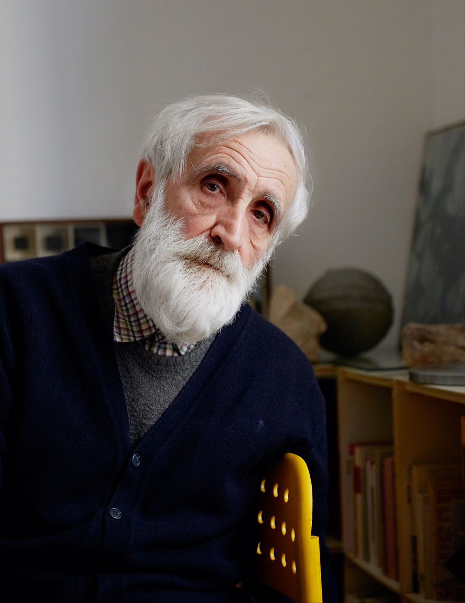
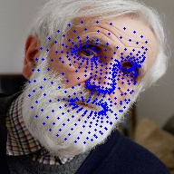

# A minimal version of Mediapipe's face mesh model.

    
    

Forked from: [thepowerfuldeez's
facemesh.pytorch](https://github.com/thepowerfuldeez/facemesh.pytorch). That
repo is itself a port of the mediapipe face mesh model, achieved by reverse
engineering the TFLite model from the ARCore iOS framework, and converting the
model into Pytorch.

I did not write any of the functionality in this repo. Only did some gardening
and de-weeding.

This is all you need to get sparse keypoints from an image with absolutely
minimal dependencies.

This is also somewhat of a statement on repo hygiene.
